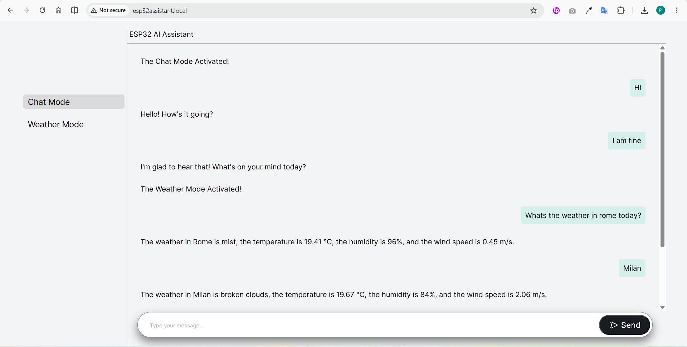

# ESP32 AI Assistant

An ESP32-powered AI assistant featuring OpenAI Chat integration and real-time weather information through a modern web interface.

---

## 📸 Preview



---

## 🎥 Demo

<a href="https://youtu.be/bula_w-3k_0" target="_blank">
 Watch Demo Video on YouTube
</a>

---

## 📂 Source Code

### ⚙️ Firmware

- [ESP32_AI_Assistant.ino](firmware/ESP32_AI_Assistant.ino)

- ESP32 Firmware
- OpenAI API Integration
- OpenWeather API Integration
- WiFiManager Configuration
- SPIFFS File Hosting
- mDNS Support

---

### 🌐 Frontend Files

- [index.html](data/index.html)
- [style.css](data/style.css)
- [script.js](data/script.js)

---

## 🧠 System Overview

This project combines embedded systems, networking, cloud APIs, and web development to create a self-hosted AI assistant running on ESP32.

Users can interact with the assistant through a browser-based interface and switch between:

- Chat Mode (OpenAI)
- Weather Mode (OpenWeather)

The ESP32 hosts the frontend directly from SPIFFS and communicates with cloud APIs using HTTP requests.

---

## ✨ Key Features

- OpenAI Chat Integration
- Real-Time Weather Information
- Browser-Based User Interface
- WiFiManager Captive Portal
- SPIFFS Static File Hosting
- mDNS Local Domain Access
- REST API Communication
- JSON Parsing with ArduinoJson
- API Response Validation During Development

---

## 🌍 Chat Mode

Chat Mode allows users to send natural language prompts to OpenAI and receive AI-generated responses directly through the ESP32-hosted web interface.

Features:

- Natural Language Interaction
- OpenAI Responses API
- Dynamic Message Rendering
- Real-Time Communication

---

## 🌦 Weather Mode

Weather Mode extracts the city name from user input and retrieves live weather information using OpenWeather API.

Displayed information:

- Weather Description
- Temperature
- Humidity
- Wind Speed

---

## 🌦 Weather Processing Workflow

1. The user enters a weather-related request through the web interface.

2. The ESP32 sends the user input to OpenAI with a prompt requesting only the city name.

3. OpenAI extracts the city name and returns it to the ESP32.

4. The ESP32 sends the extracted city name to the OpenWeather API.

5. OpenWeather returns the current weather data.

6. The ESP32 formats the response and displays it in the web interface.

### Example

User Input:

```text
What's the weather like in Milan today?
```

OpenAI Output:

```text
Milan
```

OpenWeather Request:

```text
api.openweathermap.org/data/2.5/weather?q=Milan
```

Displayed Result:

```text
The weather in Milan is clear sky, the temperature is 27°C, the humidity is 45%, and the wind speed is 2.8 m/s.
```
---

## 🔧 Technologies Used

### Embedded Systems

- ESP32
- Arduino Framework

### Networking

- WiFiManager
- HTTPClient
- WebServer
- mDNS

### APIs

- OpenAI API
- OpenWeather API

### Data Processing

- ArduinoJson
- JSON Parsing

### Frontend

- HTML
- CSS
- JavaScript

---

## 📡 API Endpoints

### Chat Endpoint

```http
POST /chat
```

Sends user messages to OpenAI and returns AI-generated responses.

### Weather Endpoint

```http
POST /weather
```

Extracts the city name from user input and returns current weather information.

---

## 📁 Project Structure

```text
firmware/   -> ESP32 source code
data/       -> HTML, CSS, JavaScript, Images
docs/       -> Screenshots and Demo Files
```

---

## 🚀 Setup Instructions

1. Install required Arduino libraries.
2. Create a `Secrets.h` file containing:
   - OpenAI API Key
   - OpenWeather API Key
   - WiFi Password
3. Upload frontend files to SPIFFS.
4. Flash firmware to ESP32.
5. Connect to WiFi using WiFiManager.
6. Open:

```text
http://ESP32Assistant.local
```

---

## 🔮 Future Improvements

- Voice Commands
- Speech Synthesis
- Streaming AI Responses
- Conversation History
- OLED Display Integration
- Multi-Language Support
- MQTT Integration

---

